<!-- Dashboard chrome: header and stat panels are static SVGs in img/ -->
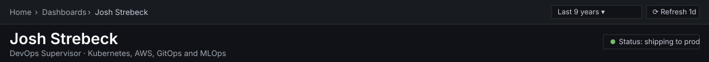

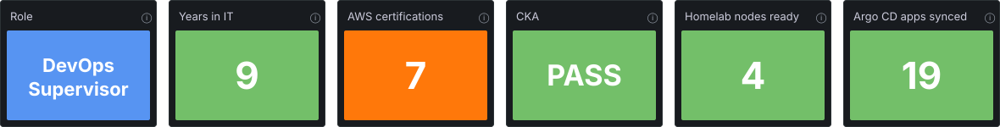

  
  
  
  
  

## About

DevOps Supervisor at a PCI DSS-regulated payments company, nine years in IT. I led the migration of a monolithic payments platform to microservices on Amazon EKS, cutting AWS costs 12%, built a Backstage developer platform that put deployments in every engineer's hands, and operate ML fraud detection on SageMaker. At home I run a four-node bare-metal Kubernetes cluster that is managed entirely through Git, and most of the projects below are built on top of it.

**Hands-on with:** Kubernetes, Argo CD, Terraform, AWS, Talos Linux, Rook-Ceph, Prometheus and Grafana, MLflow, KServe, Kubeflow, and self-hosted LLM inference.

**Certified:** AWS Solutions Architect Professional · AWS DevOps Engineer Professional · AWS Machine Learning Engineer Associate · AWS Advanced Networking Specialty · CKA · Terraform Associate

**Find me:** [strebeck.net](https://strebeck.net) · [LinkedIn](https://www.linkedin.com/in/jstrebeck) · [josh@strebeck.net](mailto:josh@strebeck.net)

## Activity

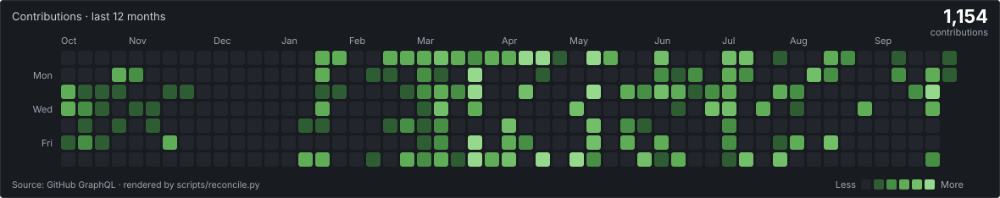

## Delivery

Featured repositories, presented the way Argo CD lists applications. Project, source path and destination are declared in [`apps.json`](apps.json). Health, revision, language, stars and last sync are rendered daily from the GitHub API by [`scripts/reconcile.py`](scripts/reconcile.py), so a failing CI run on any of them turns its row Degraded.

<a href="https://github.com/jstrebeck/Homelab-Configuration">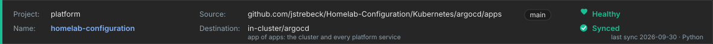</a>
<a href="https://github.com/jstrebeck/payments-fraud-detection">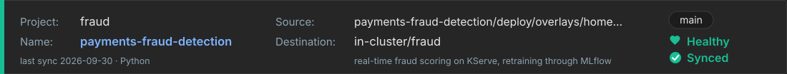</a>
<a href="https://github.com/jstrebeck/game-server-platform">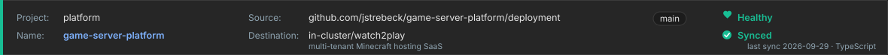</a>
<a href="https://github.com/jstrebeck/demand-forecast-mlops">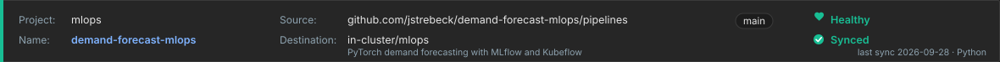</a>
<a href="https://github.com/jstrebeck/strebflow">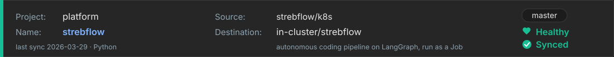</a>
<a href="https://github.com/jstrebeck/strebeck.net">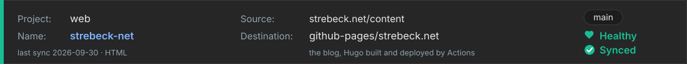</a>
<a href="https://github.com/jstrebeck/Dotfiles">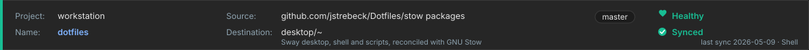</a>

## Application tree

The homelab runs Argo CD's app-of-apps pattern. One root Application, applied once by hand, owns every platform component and every workload. This is that tree, the same way Argo CD draws it, with the repos each application syncs from.

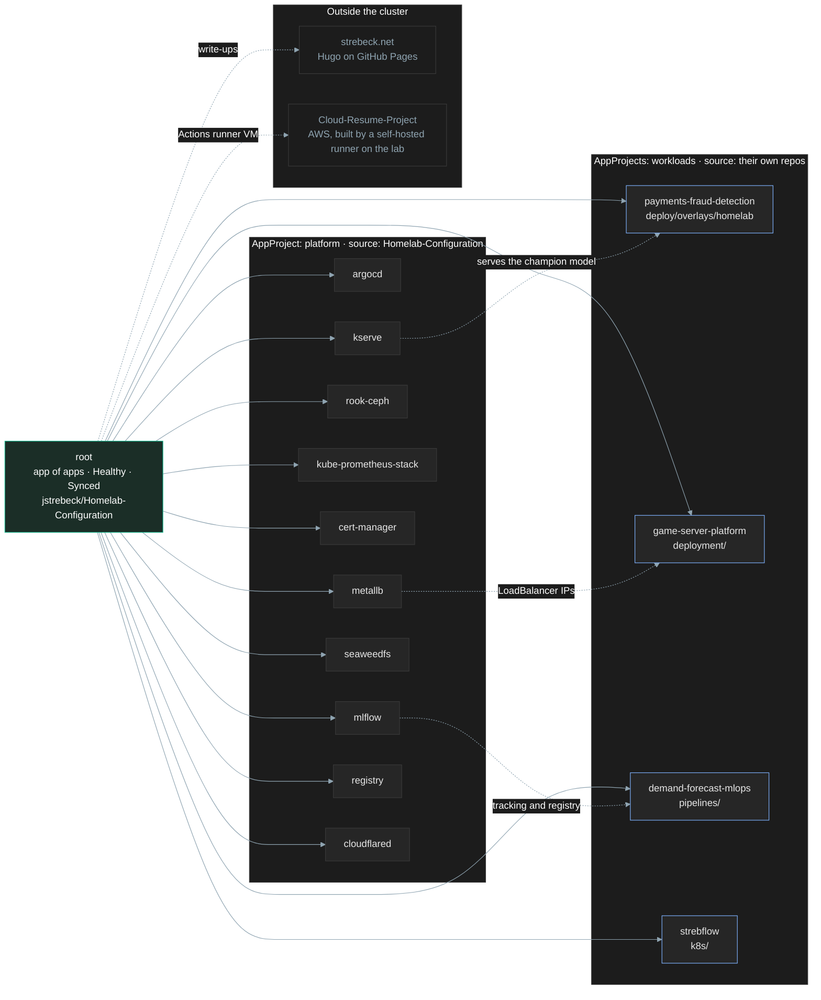

## Linux desktop

I do all of my work from a Linux desktop and keep the whole environment in Git so a fresh machine is familiar in about half an hour.

<table>
  <tr>
    <td width="60%"><a href="https://github.com/jstrebeck/Dotfiles">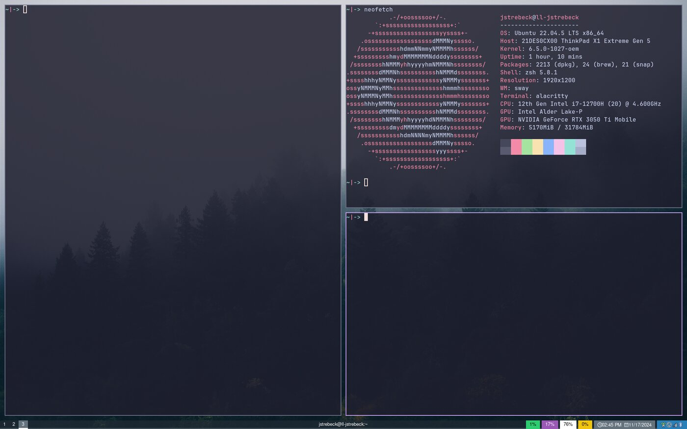</a></td>
    <td width="40%" valign="top">
      <b><a href="https://github.com/jstrebeck/Dotfiles">Dotfiles</a></b> 
      Sway on Wayland, Waybar, Rofi, Alacritty, Mako and zsh, managed with GNU Stow. One <code>deps.sh</code> bootstraps a Debian-based install, and a branch per machine carries hardware-specific config. <a href="https://strebeck.net/posts/dotfiles-a-reproducible-sway-desktop-with-gnu-stow/">Write-up</a>
        
      <b><a href="https://github.com/jstrebeck/neovim-config">neovim-config</a></b> 
      Neovim is my editor for everything. Built on the NvChad starter, large enough to live in its own repo, and cloned by the dotfiles setup script.
    </td>
  </tr>
</table>

<table>
  <tr>
    <td width="50%">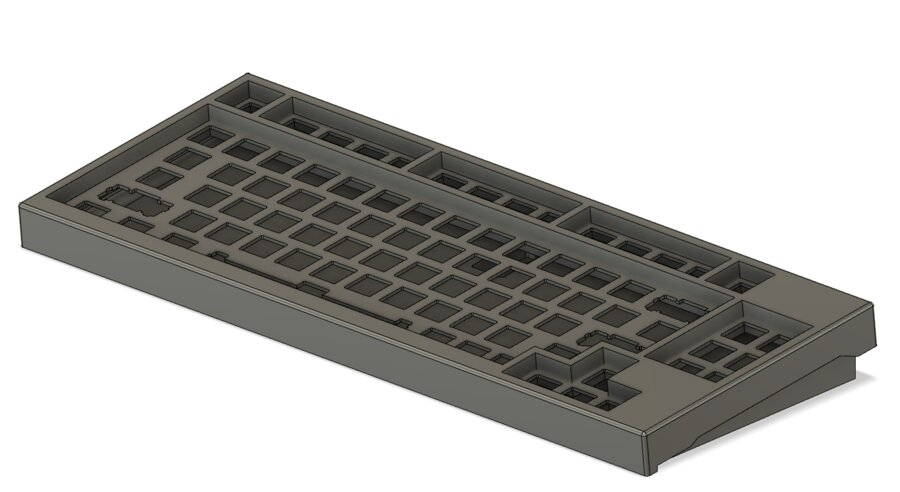</td>
    <td width="50%">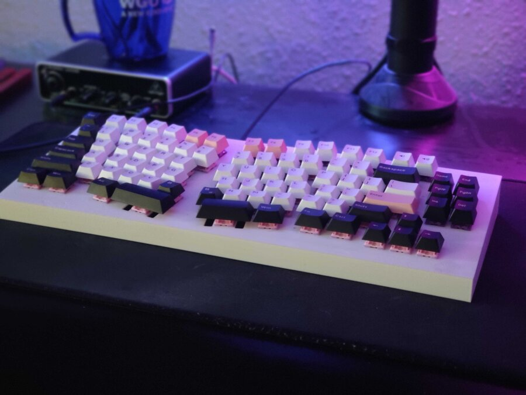</td>
  </tr>
  <tr>
    <td colspan="2">
      <b>Custom keyboards.</b> The JS80 and the split JSErgo are handwired builds with cases designed in Fusion 360 and firmware in my <a href="https://github.com/jstrebeck/qmk_firmware/tree/6f7dd71c28859d08f4661c501d80a9a2bc3899c0/keyboards/handwired/jstrebeck">QMK fork</a>. <a href="https://strebeck.net/posts/custom-keyboard-builds-js80-and-jsergo/">Write-up</a>
    </td>
  </tr>
</table>

## Latest posts

From [strebeck.net](https://strebeck.net/posts/), refreshed daily by a GitHub Action from the site's RSS feed.

<!-- BLOG-POST-LIST:START -->
- May 08, 2026 · [Dotfiles: A Reproducible Sway Desktop With GNU Stow](https://strebeck.net/posts/dotfiles-a-reproducible-sway-desktop-with-gnu-stow/)
- Apr 04, 2026 · [Training and Monitoring ML Models With PyTorch, MLflow, and Kubeflow](https://strebeck.net/posts/training-and-monitoring-ml-models-with-pytorch-mlflow-and-kubeflow/)
- Mar 29, 2026 · [StrebFlow: An Autonomous Coding Pipeline Built on LangGraph](https://strebeck.net/posts/strebflow-an-autonomous-coding-pipeline-built-on-langgraph/)
- Jan 25, 2026 · [Game Server Platform: Multi-Tenant Minecraft Hosting on Kubernetes](https://strebeck.net/posts/game-server-platform-multi-tenant-minecraft-hosting-on-kubernetes/)
- Jan 18, 2026 · [Homelab Configuration: GitOps on Talos Kubernetes with Argo CD](https://strebeck.net/posts/homelab-configuration-terraform-ansible-and-kubernetes-on-proxmox/)
- Oct 12, 2024 · [Fastest way to create a homelab Kubernetes cluster](https://strebeck.net/posts/homelab-kubernetes-cluster/)<!-- BLOG-POST-LIST:END -->

Dashboard defined in Git. Header and stat panels are static SVGs, the streak panel comes from streak-stats, and the contribution heatmap, application rows and posts are reconciled daily by GitHub Actions.
